  

  
  
  
  

---

# 🐟 Awesome Aquaculture Management 🌊

> **A curated, comprehensive list of SaaS platforms, open-source software, IoT water quality monitoring systems, computer vision biomass platforms, and research tools for modern aquaculture, fish farming, and mariculture operations.**

Welcome to the ultimate directory for **digital aquaculture tech**! Whether you are operating commercial net pens, recirculating aquaculture systems (RAS), shrimp ponds, hatcheries, or building open-source smart farm software, this guide covers the top production, analytics, and automation software across the global blue economy. 🐠📊

---

## 📑 Table of Contents
- [📈 Industry Overview & Market Size](#-industry-overview--market-size)
- [🏢 SaaS & Commercial Platforms](#-saas--commercial-platforms)
- [💻 Open-Source GitHub Projects](#-open-source-github-projects)
- [🤝 How to Contribute](#-how-to-contribute)
- [⚠️ Disclaimer](#%EF%B8%8F-disclaimer)
- [☕ Support & Community](#-support--community)
- [📈 Star History](#-star-history)

---

## 📈 Industry Overview & Market Size

> 💡 **Market Insights:** The global digital aquaculture management & IoT software market is estimated at **$3.5 Billion USD** (within the broader **$300+ Billion** global commercial aquaculture industry), expanding at a **11.2% CAGR**.  
> The sector is **highly fragmented** across regions and species (e.g., European salmon cage farming vs. Asian shrimp and tilapia pond farming). Enterprise suites lead industrial net-pen operations, while modular SaaS platforms and open-source IoT sensors dominate small-to-midscale aquaculture farms.

---

## 🏢 SaaS & Commercial Platforms

Commercial aquaculture management software powers stock tracking, feeding telemetry, water quality analytics, biosecurity compliance, and processing integration.

| 🏢 Platform / Product | 💰 Company Size / Valuation / Revenue | 🏷️ Starting Pricing | 🎁 Free Tier Limit / Trial Duration | 🎯 Key Focus & Features |
| :--- | :--- | :--- | :--- | :--- |
| **[eFishery](https://efishery.com)** 🇮🇩 | Valuation: **$1.4 Billion (Unicorn)** Audited Rev: **$157 Million** | **$20/month** rental (IDR 300k) or **$400** purchase per feeder | **eFisheryKu Free App** (Unlimited basic log entries & advisory) | Smart automated fish & shrimp feeding (eFeeder), water monitoring, input marketplace. 🦐 |
| **[AKVA group (FishTalk)](https://www.akvagroup.com)** 🇳🇴 | Revenue: **$320 Million (MNOK 3,400)** Valuation: **~$250 Million** | **$500/month** base site enterprise plan | **14-Day Enterprise Demo** (Guided setup upon request) | Enterprise salmon & finfish ERP, feeding control systems, biological growth modeling. 🐟 |
| **[ScaleAQ](https://scaleaq.com)** 🇳🇴 | Revenue: **$300 Million** Valuation: **~$200 Million** | **$450/month** base site plan | **30-Day Guided Pilot** (Hardware & digital suite demo) | Cage infrastructure digital twin, net-pen sensors, camera biomass estimation & RAS control. 🌐 |
| **[Innovasea (Farm360)](https://www.innovasea.com)** 🇺🇸 | Revenue: **$100 Million+** Valuation: **~$300 Million** | **$250/month** base farm plan | **14-Day Interactive Tour** & free live demo | Real-time ocean environmental sensors, acoustic fish tracking, water quality analytics. 🌊 |
| **[Aquaconnect](https://aquaconnect.blue)** 🇮🇳 | Revenue: **$38 Million (₹313 Cr)** Valuation: **~$150 Million** | **$6/month/pond** (₹500/mo/pond) for Pro tier | **AquaONE Free Basic Tier** (Unlimited ponds, basic logs) | AI & satellite remote sensing for shrimp & fish farm advisory, financial & market linkages. 📡 |
| **[Aquabyte](https://www.aquabyte.ai)** 🇺🇸 | Valuation: **~$150 Million** Total Funding: **$46 Million** | **$1,500/cage/month** software & camera lease | **30-Day On-Site Trial** (Hardware installation trial) | AI computer vision for underwater biomass estimation, sea lice automated detection, welfare. 📷 |
| **[Bluegrove / CageEye](https://bluegrove.com)** 🇳🇴 | Valuation: **~$80 Million** Total Funding: **$25 Million** | **$800/cage/month** sensor & AI analytics | **14-Day Guided Trial** (Acoustic feeding analysis demo) | Hydroacoustic sensors & machine learning algorithms for autonomous fish feeding optimization. 🔊 |
| **[JALA Tech](https://jala.tech)** 🇮🇩 | Valuation: **~$50 Million** Total Funding: **$13.1 Million** | **$6.50/month/pond** (IDR 100k) or **$39/year/pond** | **JALA Free Basic App** (Up to 2 ponds) & **14-Day Pro Trial** | Shrimp farm digital management, multiparameter IoT water meters, disease forecast alerts. 🧪 |
| **[aquaManager](https://www.aquamanager.com)** 🇬🇷 | Revenue: **~$10 Million** Valuation: **~$30 Million** | **$150/month** starter farm plan | **14-Day Free Demo Trial** (Full SaaS feature access) | End-to-end hatchery to harvest stock control, biomass estimation, feed conversion (FCR) tracking. 📊 |

---

## 💻 Open-Source GitHub Projects

Open-source aquaculture tools enable self-hosted farm management, custom IoT telemetry, genomic selection, and scientific marine research.

| 🚀 Repository | 🌟 GitHub_Stars | 🛠️ Tech Stack & Language | 📝 Overview & Core Functionality |
| :--- | :--- | :--- | :--- |
| **[frappe/erpnext](https://github.com/frappe/erpnext)** |  | Python, Vue, JS | Open-source enterprise ERP with agriculture & farm management modules adaptable for fish inventory, harvest tracking, and cost accounting. 🚜 |
| **[pragalbhdwivedi/aquapulse](https://github.com/pragalbhdwivedi/aquapulse)** |  | TypeScript, React, Node.js | Self-hosted open-source aquaculture operations platform—pond/batch logging, feeding schedules, water quality parameters, and dashboards. 📊 |
| **[climatechange-ai-tutorials/aquaculture-mapping](https://github.com/climatechange-ai-tutorials/aquaculture-mapping)** |  | Jupyter Notebook, Python, PyTorch | Deep learning satellite imagery tutorial & models for detecting, mapping, and monitoring coastal aquaculture ponds. 🛰️ |
| **[IBM/PrecisionAquaculture.jl](https://github.com/IBM/PrecisionAquaculture.jl)** |  | Julia | Machine learning and data-driven analysis framework for environmental and hydroacoustic aquaculture datasets. 🔬 |
| **[KrisKraa/OpenAQUA](https://github.com/KrisKraa/OpenAQUA)** |  | C++, ESP32, CAN Bus | Modular open-source hardware water controller (ESP32-S3) for real-time monitoring of pH, TDS, temperature, and automated dosing. 🔌 |
| **[lyonscw/AquaGS_GUI](https://github.com/lyonscw/AquaGS_GUI)** |  | R, Shiny, GUI | Open GUI tool for aquaculture breeding programs—genomic selection (GS) workflow from VCF files to mate allocation. 🧬 |
| **[frabas/DISPLACE_GUI](https://github.com/frabas/DISPLACE_GUI)** |  | C++, R, Shiny | Spatial bio-economic model & GUI for marine fisheries, aquaculture zoning, and ecosystem spatial management. 🗺️ |
| **[Bukharney/Fishcare](https://github.com/Bukharney/Fishcare)** |  | Dart, Flutter, Firebase | Cross-platform IoT mobile app for real-time fish farm monitoring, automated feeder controls, and water metric alerts. 📱 |
| **[ATSpuler/AquacultureML](https://github.com/ATSpuler/AquacultureML)** |  | Python, Scikit-Learn | Machine learning research stack for dissolved oxygen (DO) prediction and water quality time-series forecasting. 🤖 |

---

## 🤝 How to Contribute

Contributions are enthusiastically welcomed! Help keep this awesome list accurate and up to date:

1. 🍴 **Fork** this repository.
2. 📝 **Add or update** entries in `README.md` following the table format.
3. 🔎 **Provide verifiable details**: Product name, official link, pricing, free trial limits, and company revenue/funding data.
4. 🚀 **Submit a Pull Request** with a brief summary of additions.

For list format guidelines, refer to [Awesome-Awesome-Awesome](https://github.com/ishandutta2007/Awesome-Awesome-Awesome).

---

## ⚠️ Disclaimer

- This repository is a **community-curated index** for informational and educational purposes.
- **Biosecurity & Operational Risk:** Aquaculture operations directly affect live stock health, environmental ecosystems, and food safety. Hardware/software solutions should be verified with certified aquaculture specialists and veterinary guidance before deployment in industrial production.

---

## ☕ Support & Community

Thank you for exploring **Awesome Aquaculture Management**! 🐟  
If you find this repository helpful for your fish farming operations, research, or development:

- ⭐ **Star** this repository to stay updated with new tools.
- 🔀 **Fork** and contribute open-source software or SaaS products.
- 📢 **Share** with fish farmers, marine biologists, and aquaculture technologists!

---

## 📈 Star History

